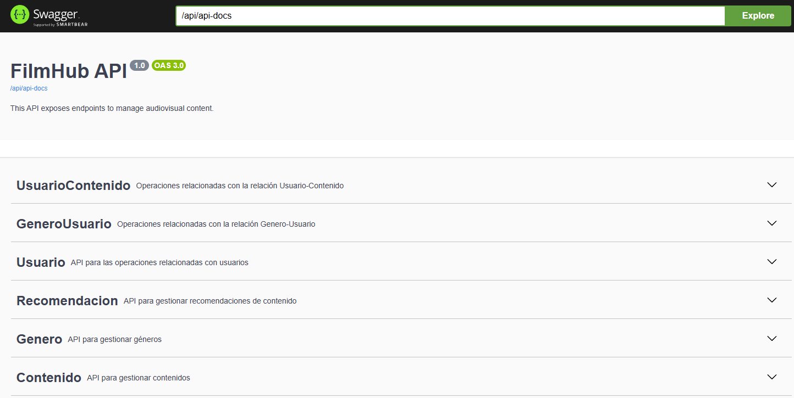

# 📽️ Filmhub - Backend

[](https://www.gnu.org/licenses/gpl-3.0)


Una aplicación **REST API** robusta creada con **Spring Boot** para gestionar contenido audiovisual, utilizando **Azure SQL Database** o **PostgreSQL**.

## 📑 Tabla de Contenidos

- [🚀 Descripción](#-descripción)
- [🛠️ Tecnologías Utilizadas](#️-tecnologías-utilizadas)
- [📂 Estructura del Proyecto](#-estructura-del-proyecto)
- [📦 Dependencias Principales](#-dependencias-principales)
- [🔧 Configuración de Entorno](#-configuración-de-entorno)
  - [Azure SQL Database](#azure-sql-database)
    -  [🏗️ Creación de la Infraestructura](#️-creación-de-la-infraestructura)
    - [💥 Destrucción de la Infraestructura](#-destrucción-de-la-infraestructura)
  - [PostgreSQL](#postgresql)
- [🚀 Compilación y Ejecución del Proyecto](#-compilación-y-ejecución-del-proyecto)
- [🧪 Pruebas](#-pruebas)
- [📡 Endpoints](#-endpoints)
- [🤝 Contribuir](#-contribuir)
- [🔒 Seguridad](#-seguridad)
- [📄 Licencia](#-licencia)

## 🚀 Descripción

Filmhub es una aplicación backend diseñada para ofrecer una experiencia completa en la gestión de contenido audiovisual. Permite a los usuarios:

- Registrarse y gestionar sus perfiles
- Explorar un catálogo extenso de películas y series
- Agregar contenido a listas personalizadas
- Marcar contenido como visto o no visto
- Recibir recomendaciones personalizadas basadas en sus preferencias

Esta API RESTful proporciona la base para construir aplicaciones frontend robustas y escalables en el dominio del streaming y la gestión de contenido multimedia.

## 🛠️ Tecnologías Utilizadas

- **Spring Boot**: Framework Java para desarrollo rápido de aplicaciones con configuración mínima.
- **Spring Data JPA**: Simplifica el acceso a datos utilizando el estándar JPA con Hibernate.
- **Azure SQL Database**: Base de datos relacional en la nube, totalmente administrada y con alta disponibilidad.
- **PostgreSQL**: Sistema de gestión de bases de datos relacional de código abierto.
- **Maven**: Herramienta de gestión y construcción de proyectos Java.
- **Postman**: Plataforma de colaboración para el desarrollo de API.
- **GitHub Codespaces**: Entorno de desarrollo en la nube integrado con GitHub.
- **Azure CLI**: Interfaz de línea de comandos para gestionar recursos de Azure.

## 📂 Estructura del Proyecto

La estructura del proyecto sigue las mejores prácticas de Spring Boot, dividiendo la lógica en capas como controladores, modelos, repositorios, y más.

```
src/
├── main/
│   ├── java/
│   │   └── com/
│   │       └── udea/
│   │           └── filmhub/
│   │               ├── config/
│   │               ├── controller/
|   |               ├── dto/
│   │               ├── exceptions/
│   │               ├── model/
│   │               ├── repository/
│   │               ├── service/
│   │               └── FilmhubApplication.java
│   └── resources/
│       ├── static/
│       ├── templates/
│       ├── application-dev.properties
│       ├── application-pdn.properties
│       └── application.properties
└── test/
```

### 📂 Descripción de carpetas

1. **`config/`**: Configuraciones de la aplicación, como seguridad, CORS, y otros ajustes específicos.
2. **`controller/`**: Controladores REST que manejan las peticiones HTTP y definen los endpoints de la API.
3. **`dto/`**: Objetos de transferencia de datos utilizados para mover datos entre las capas de la aplicación.
4. **`exceptions/`**: Manejo personalizado de excepciones.
5. **`model/`**: Entidades JPA que representan las tablas en la base de datos.
6. **`repository/`**: Interfaces que extienden `JpaRepository` para operaciones CRUD.
7. **`service/`**: Implementación de la lógica de negocio.
8. **`resources/`**: Archivos de configuración y recursos estáticos.
9. **`test/`**: Pruebas unitarias e integración.

## 📦 Dependencias Principales

- **Spring Boot Starter Web**: Proporciona las bibliotecas necesarias para construir aplicaciones web y RESTful.
- **Spring Boot Starter Data JPA**: Integración con JPA y Hibernate.
- **Microsoft SQL Server JDBC Driver**: Conector para Azure SQL Database.
- **PostgreSQL Driver**: Conector para PostgreSQL.
- **Spring Boot Starter Data JDBC**: Proporciona soporte para JDBC, simplificando el acceso a bases de datos relacionales.
- **Spring Cloud Azure Starter**: Proporciona integración con los servicios de Azure
- **Spring Boot Starter Test**: Soporte para pruebas unitarias e integración.
- **Springdoc OpenAPI Starter WebMVC UI**:Proporciona integración con OpenAPI para la documentación de la API.
- **Jackson Datatype JSR310**: Añade soporte para tipos de datos de Java 8 y manejo de json.

## 🔧 Configuración de Entorno

**Clona el repositorio:**

```bash
    git clone https://github.com/RickContreras/FilmHub-backend.git
    cd FilmHub-backend
```

### Azure SQL Database

1. Crea un archivo `env.sh`:

```sh
#!/bin/sh

echo "Estableciendo variables de entorno"

# Nombre del grupo de recursos en Azure
export AZ_RESOURCE_GROUP=filmhub

# Nombre del servidor de la base de datos en Azure
export AZ_DATABASE_SERVER_NAME=servidorfilmhub

# Nombre de la base de datos en Azure
export AZ_DATABASE_NAME=demo

# Ubicación de la base de datos en Azure
export AZ_LOCATION=australiaeast

# Nombre de usuario para la base de datos SQL en Azure
export AZ_SQL_SERVER_USERNAME=spring

# Contraseña para la base de datos SQL en Azure
export AZ_SQL_SERVER_PASSWORD=XXXXXXXXXXX

# Obtener la dirección IP local
export AZ_LOCAL_IP_ADDRESS=$(curl -s https://api.ipify.org)

# Nombre de usuario para la fuente de datos de Spring
export SPRING_DATASOURCE_USERNAME=$AZ_SQL_SERVER_USERNAME@$AZ_DATABASE_SERVER_NAME

# Contraseña para la fuente de datos de Spring
export SPRING_DATASOURCE_PASSWORD=$AZ_SQL_SERVER_PASSWORD

# URL de la fuente de datos de Spring
export SPRING_DATASOURCE_URL="jdbc:sqlserver://$AZ_DATABASE_SERVER_NAME.database.windows.net:1433;database=$AZ_DATABASE_NAME;user=$SPRING_DATASOURCE_USERNAME;password=$SPRING_DATASOURCE_PASSWORD;encrypt=true;trustServerCertificate=false;hostNameInCertificate=*.database.windows.net;loginTimeout=30;"
```

2. Configura un `AZ_DATABASE_NAME` único y una `AZ_SQL_SERVER_PASSWORD` segura.

#### 🏗️ Creación de la Infraestructura

Para Azure SQL Database:

```sh
az login
source env.sh
./deploy-database.sh
```

#### 💥 Destrucción de la Infraestructura

Para eliminar la infraestructura de Azure:

```sh
./destroy-all.sh
```

### PostgreSQL

1. Instala y configura PostgreSQL.
2. Crea la base de datos:

```sql
CREATE DATABASE filmhub;
```

3. Configura `src/main/resources/application-dev.properties`:

```properties
spring.datasource.url=jdbc:postgresql://localhost:5432/filmhub
spring.datasource.username=tu_usuario
spring.datasource.password=tu_contraseña
```

## 🚀 Compilación y Ejecución del Proyecto

```sh
./mvnw clean install
./mvnw spring-boot:run
```

O usa el botón para abrir en GitHub Codespaces y ejecutalos para trabajar con PostgreSQL:

[](https://github.com/codespaces/new?template_repository=RickContreras/filmhub-backend)

### Nota

* Para usar Swagger en Codespaces, realice los siguientes cambios en `application-dev.properties`:

```properties
swagger.server.url=https://la-url-de-su-codespace-8080.app.github.dev/api
```

Además, asegúrese de configurar el puerto 8080 como "Público" y en "http".

* Si esta trabajando con variables de entorno, se tiene que ejecutar las variables de entorno cada vez que se vuelva activar el codespace.
```sh
source env.sh
```

## 🧪 Pruebas

Ejecuta las pruebas con:

```sh
./mvnw test
```
> 🚧 En desarrollo

## 📡 Endpoints
Todos los endpoints inician con ´/api´:



Para ver el Swagger anterior con más detalle, use:
```
https://la-url/api/swagger-ui/index.html # o 
https://la-url/api/swagger-ui.html
```

## 🤝 Contribuir

1. Fork el repositorio
2. Crea una nueva rama (`git checkout -b feature/nueva-funcionalidad`)
3. Realiza tus cambios y haz commit (`git commit -am 'Añadir nueva funcionalidad'`)
4. Push a la rama (`git push origin feature/nueva-funcionalidad`)
5. Abre un Pull Request

Por favor, asegúrate de actualizar las pruebas según sea necesario y sigue nuestro código de conducta.

## 🔒 Seguridad

Actualmente, este proyecto no implementa medidas de seguridad. Para un entorno de producción, se recomienda integrar:

- **Spring Security** para autenticación y autorización.
- **JWT** para manejo de tokens de sesión.
- **HTTPS** para encriptación de datos en tránsito.
- Implementar buenas prácticas como validación de entrada, manejo seguro de errores, y protección contra ataques comunes (CSRF, XSS, etc.).

> (🚧 En desarrollo)

---
Desarrollado con ❤️ por el equipo de Filmhub